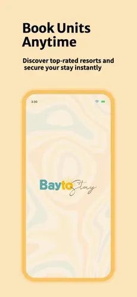
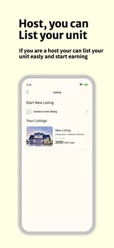
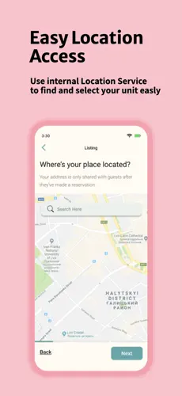
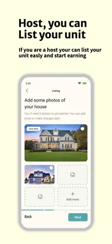
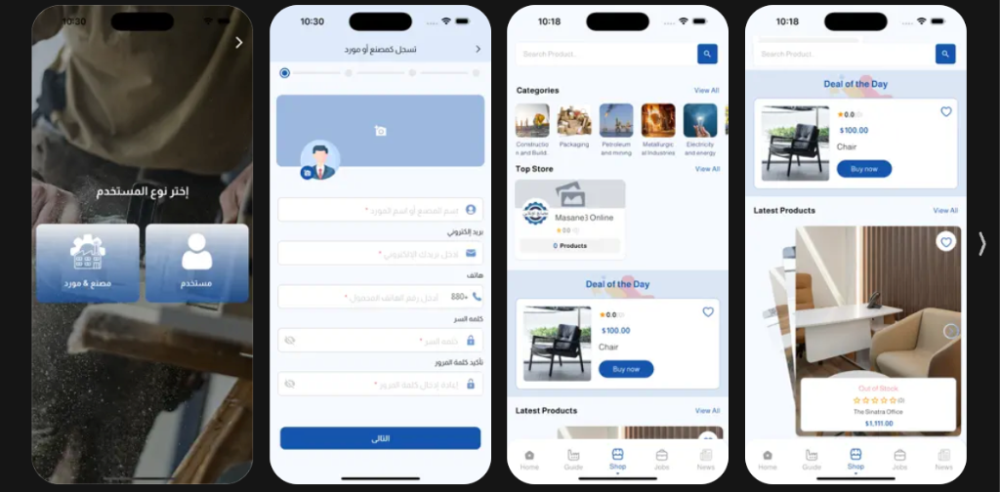
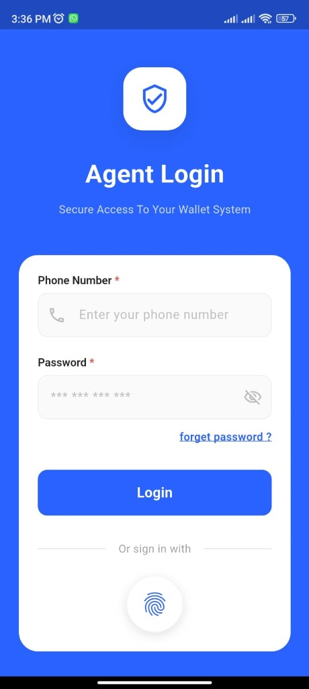
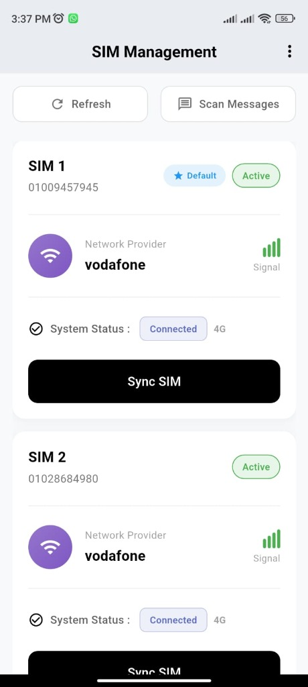
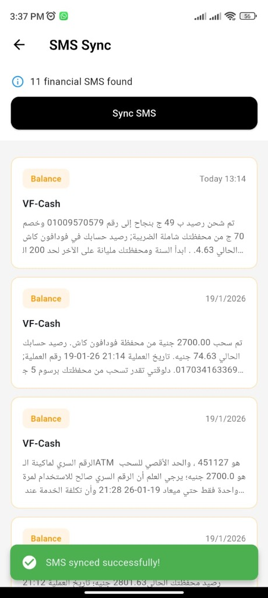
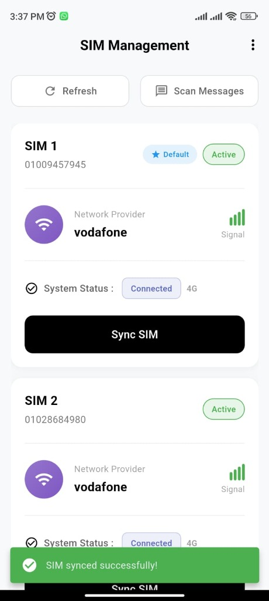

  

- 🔭 I’m currently working as **Mobile Developer**

- 💬 Ask me about **Flutter,Dart**

- 📫 How to reach me **a.tamer7112002@gmail.com**

<h3 align="left">Connect with me:</h3>

<h3 align="left">Languages and Tools:</h3>

          

<h2> Samples from my Live projects </h2>

### Baytostay
● Led development of Baytostay, a production-ready rental platform on Play Store &
  App Store. 
● Designed app architecture: state management, API integration, WS, CI/CD, and
scalable components. 
● Implemented Google Maps, push notifications, and secure local storage. 
● Mentored junior developer and optimized performance based on user feedback. 

    
    
    
    

  

### Masane3 Online | مصانع أونلاين

● Developed Masane3 Online, an integrated B2B & B2C industrial digital directory and e-commerce platform connecting factories, raw material suppliers, and clients. 
● Implemented dual-role registration (Factory/Supplier & Customer), product listings, deal of the day promotions, and industrial job listings. 
● Integrated Google Maps for business locations, real-time product browsing, and direct communication channels. 

    

 

<h2> Samples from my random projects </h2>

### FinTrackr

A secure, intelligent financial management application designed to bridge the gap between mobile network SIM management and financial transactions. Built with **Flutter**, Clean Architecture, and BLoC pattern for predictable state management.

● **Biometric Security & Authentication**: Secure wallet access using Fingerprint/Face ID with `local_auth` and session management. 
● **Dual SIM Management**: Real-time signal strength monitoring, network health checks, and one-tap multi-SIM synchronization. 
● **Smart SMS Sync**: Automatically detects and categorizes financial SMS alerts and synchronizes transactions in real time. 

    
    
    
    

 

